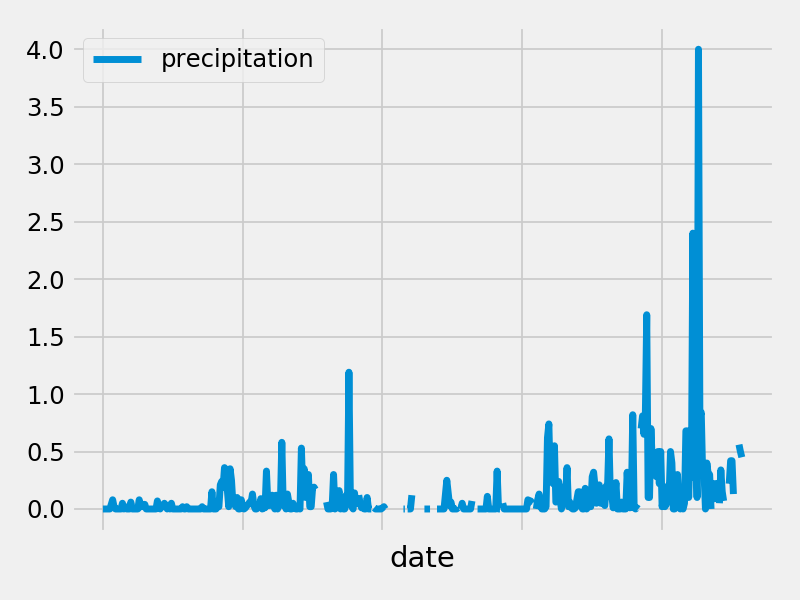
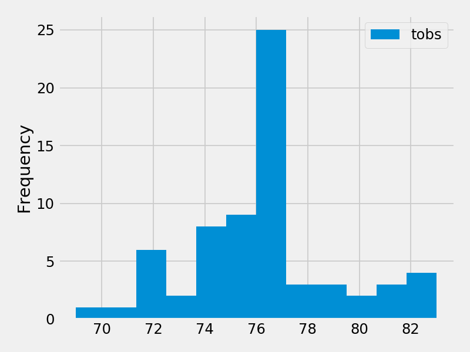

# Surfs Up!

## Step 1 - Climate Analysis and Exploration

Uses Python and SQLAlchemy to do basic climate analysis and data exploration of a climate database. All of the following analysis is completed using SQLAlchemy ORM queries, Pandas, and Matplotlib.

### Precipitation Analysis

* Query sqlite database to retrieve the last 12 months of precipitation data.

* Selects only the `date` and `prcp` values.

* Loads the query results into a Pandas DataFrame and set the index to the date column.

* Sorts the DataFrame values by `date`.

* Plot the results using the DataFrame `plot` method.

  

* Uses Pandas to print the summary statistics for the precipitation data.

### Station Analysis

* Queries to calculate the total number of stations.

* Queries to find the most active stations.

  * Lists the stations and observation counts in descending order.

  * Determines which station has the highest number of observations.

* Queries to retrieve the last 12 months of temperature observation data (tobs).

  * Filters by the station with the highest number of observations.

  * Plots the results as a histogram with `bins=12`.

    

### Temperature Analysis (Optional)

* Uses the `calc_temps` function to calculate the min, avg, and max temperatures for your trip using the matching dates from the previous year (i.e., use "2017-01-01" if your trip start date was "2018-01-01").

* Plots the min, avg, and max temperature from the previous query as a bar chart.

  * Uses the average temperature as the bar height.

  * Uses the peak-to-peak (tmax-tmin) value as the y error bar (yerr).

    

### Other Analyses 

  * Calculates the rainfall per weather station using the previous year's matching dates.

* Calculates the daily normals. Normals are the averages for the min, avg, and max temperatures.

  * Create a list of dates in the format `%m-%d`. Uses the `daily_normals` function to calculate the normals for each date string and appends the results to a list.

  * Loads the list of daily normals into a Pandas DataFrame and set the index equal to the date.

  * Uses Pandas to plot an area plot (`stacked=False`) for the daily normals.

    

- - -

## Step 2 - Climate App

Creates a Flask API based on the queries that you have just developed.

* Uses FLASK to create  routes.

### Routes

* `/api/v1.0/precipitation`

  * Queries for the dates and temperature observations from the last year.

  * Converts the query results to a Dictionary using `date` as the key and `tobs` as the value.

  * Returns the JSON representation of your dictionary.

* `/api/v1.0/stations`

  * Returns a JSON list of stations from the dataset.

* `/api/v1.0/tobs`

  * Returns a JSON list of Temperature Observations (tobs) for the previous year.

* `/api/v1.0/<start>` and `/api/v1.0/<start>/<end>`

  * Returns a JSON list of the minimum temperature, the average temperature, and the max temperature for a given start or start-end range.

  * When given the start only, calculates `TMIN`, `TAVG`, and `TMAX` for all dates greater than and equal to the start date.

  * When given the start and the end date, calculates the `TMIN`, `TAVG`, and `TMAX` for dates between the start and end date inclusive.

